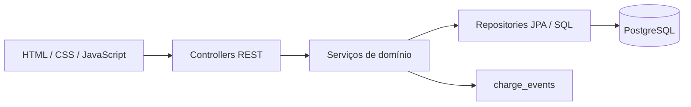

# Fluxo

[](https://github.com/EnzoGui18/Sistemas-Pagamentos/actions/workflows/ci.yml)

Sistema de portfólio para gerenciar clientes fictícios, cobranças em BRL e pagamentos integralmente simulados. O Fluxo reúne API REST, regras transacionais, PostgreSQL e uma interface web responsiva no mesmo monólito modular.

> O sistema não processa dinheiro real e não se conecta a bancos, adquirentes, Pix ou cartões. Use somente dados fictícios.

## Funcionalidades

- Cadastro e consulta paginada de clientes.
- Criação, listagem, filtros e detalhamento de cobranças.
- Condições `PENDING`, `OVERDUE`, `PAID` e `CANCELED`.
- Pagamento integral simulado com idempotência.
- Cancelamento e histórico transacional de eventos.
- Dashboard com quantidades e valores por condição.
- Interface web responsiva, sem framework frontend.
- Erros HTTP em `application/problem+json` com `traceId`.
- Healthcheck de liveness/readiness com Spring Boot Actuator.

## Stack

| Área | Tecnologias |
| --- | --- |
| Backend | Java 21, Spring Boot 4.1.1, Spring MVC, Validation |
| Persistência | Spring Data JPA, PostgreSQL 17, Flyway |
| Frontend | HTML, CSS e JavaScript puro |
| Testes | JUnit, Spring Test, Testcontainers/PostgreSQL, Playwright e axe |
| Operação | Maven, Docker, Docker Compose, Actuator |
| CI | GitHub Actions |

## Pré-requisitos

Para a execução recomendada:

- Docker Desktop ou Docker Engine com Compose v2.
- Porta `8080` livre em `localhost`.

Para executar sem o container da aplicação:

- JDK 21.
- Maven 3.9 ou superior.
- PostgreSQL 17 acessível pela máquina host.
- Docker disponível para os testes de integração.
- Node.js 24 para os testes E2E e de acessibilidade.

## Início rápido

Na raiz do repositório:

```bash
docker compose up --build
```

O Compose aguarda o PostgreSQL ficar saudável, inicia a aplicação, aplica a migration Flyway e valida o mapeamento JPA. O banco fica acessível somente pela rede interna do Compose; apenas a aplicação publica uma porta no host.

Depois da inicialização:

- Interface: <http://localhost:8080>
- Healthcheck: <http://localhost:8080/actuator/health>
- Readiness: <http://localhost:8080/actuator/health/readiness>

Para acompanhar e encerrar:

```bash
docker compose ps
docker compose logs -f app
docker compose down
```

`docker compose down` preserva o banco. Para também apagar o volume e todos os dados locais, use `docker compose down -v`.

## Configuração

Os valores padrão do Compose são apenas para desenvolvimento local. Para personalizá-los:

```bash
cp .env.example .env
```

No PowerShell:

```powershell
Copy-Item .env.example .env
```

| Variável | Padrão local | Finalidade |
| --- | --- | --- |
| `POSTGRES_DB` | `fluxo` | Banco criado pelo container |
| `POSTGRES_USER` | `fluxo` | Usuário local do PostgreSQL |
| `POSTGRES_PASSWORD` | `fluxo_local` | Senha local do PostgreSQL |
| `DB_URL` | Depende do modo de execução | URL JDBC |
| `DB_USERNAME` | `fluxo` | Usuário usado pela aplicação |
| `DB_PASSWORD` | `fluxo_local` | Senha usada pela aplicação |
| `DB_POOL_SIZE` | `10` | Máximo de conexões da aplicação |
| `SERVER_PORT` | `8080` | Porta HTTP da aplicação |

O arquivo `.env` é ignorado pelo Git. Não use os valores locais em ambientes publicados.

### Aplicação pelo Maven

```bash
mvn spring-boot:run
```

Nesse modo, a configuração padrão usa `jdbc:postgresql://localhost:5432/fluxo`. Defina `DB_URL`, `DB_USERNAME` e `DB_PASSWORD` caso seu PostgreSQL use outro endereço ou credenciais. O banco do Compose não publica porta no host; ele existe apenas para a aplicação em container.

## Testes

A suíte usa PostgreSQL real por meio do Testcontainers. O Docker precisa estar disponível:

```bash
mvn -B -ntp verify
```

Para executar somente um conjunto:

```bash
mvn -B -ntp -Dtest=DashboardApiIntegrationTests test
mvn -B -ntp -Dtest=PaymentAndCancellationIntegrationTests test
```

Os testes cobrem persistência, validações, paginação, mudança de dia, migrations, idempotência, rollback e corridas reais entre pagamento e cancelamento.

### Navegador e acessibilidade

Com a aplicação iniciada pelo Compose, instale o Chromium gerenciado pelo Playwright e execute:

```bash
cd e2e
npm ci
npx playwright install chromium
npm test
```

O fluxo roda em Chromium desktop e em viewport mobile Pixel 7. Ele cadastra cliente, cria e paga uma cobrança, verifica overflow horizontal e audita painel, formulários e detalhe com axe nas regras WCAG 2 A/AA. Screenshots, vídeos e traces são gerados como evidência real quando aplicável e ficam fora do Git.

## Exemplos de API

Os exemplos usam dados fictícios. No PowerShell, execute `curl.exe` para evitar o alias de `Invoke-WebRequest`.

### Criar cliente

```bash
curl -i -X POST http://localhost:8080/api/v1/clients \
  -H "Content-Type: application/json" \
  -d '{"name":"Cliente Demonstração","email":"cliente.demo@example.com"}'
```

Guarde o `id` retornado como `CLIENT_ID`.

### Criar cobrança

```bash
curl -i -X POST http://localhost:8080/api/v1/charges \
  -H "Content-Type: application/json" \
  -d '{"clientId":"CLIENT_ID","description":"Serviço de demonstração","amount":149.90,"dueDate":"2030-12-15"}'
```

Guarde o `id` retornado como `CHARGE_ID`. A data precisa ser hoje ou futura na zona `America/Sao_Paulo`.

### Consultar e filtrar cobranças

```bash
curl "http://localhost:8080/api/v1/charges?condition=PENDING&page=0&size=20"
curl http://localhost:8080/api/v1/charges/CHARGE_ID
curl http://localhost:8080/api/v1/charges/CHARGE_ID/events
```

### Simular pagamento

```bash
curl -i -X POST http://localhost:8080/api/v1/charges/CHARGE_ID/payments \
  -H "Idempotency-Key: demo-payment-001"
```

A primeira conclusão retorna `201`. Repetir a mesma chave para a mesma cobrança retorna `200` e o pagamento existente. Usar a chave em outra cobrança retorna `409`.

### Cancelar cobrança

```bash
curl -i -X POST http://localhost:8080/api/v1/charges/CHARGE_ID/cancellation
```

### Consultar dashboard

```bash
curl http://localhost:8080/api/v1/dashboard/summary
```

## Endpoints

| Método | Rota | Resultado principal |
| --- | --- | --- |
| `POST` | `/api/v1/clients` | Cria cliente, `201 + Location` |
| `GET` | `/api/v1/clients` | Busca paginada por nome/e-mail |
| `POST` | `/api/v1/charges` | Cria cobrança, `201 + Location` |
| `GET` | `/api/v1/charges` | Filtra por condição e cliente |
| `GET` | `/api/v1/charges/{id}` | Detalha cobrança |
| `POST` | `/api/v1/charges/{id}/payments` | Simula pagamento, `201` ou replay `200` |
| `POST` | `/api/v1/charges/{id}/cancellation` | Cancela cobrança pendente |
| `GET` | `/api/v1/charges/{id}/events` | Retorna histórico ordenado |
| `GET` | `/api/v1/dashboard/summary` | Retorna indicadores do painel |
| `GET` | `/actuator/health` | Saúde geral sem detalhes internos |
| `GET` | `/actuator/health/readiness` | Prontidão da aplicação e banco |

Paginação começa em zero e aceita no máximo 100 elementos por página.

## Estados e idempotência

```text
                 pagamento
PENDING --------------------------> PAID
   |
   | cancelamento
   v
CANCELED
```

- `OVERDUE` não é persistido. É exibido quando uma cobrança `PENDING` vence antes do dia atual em São Paulo.
- Uma cobrança pendente pode ser paga ou cancelada mesmo estando vencida.
- `PAID` e `CANCELED` são estados terminais.
- O valor do pagamento é copiado da cobrança pelo servidor.
- Pagamento, mudança de estado e evento são confirmados na mesma transação.
- Locks de banco, `@Version` e constraints `UNIQUE` impedem duas transições vencedoras.
- A idempotência cobre pagamentos concluídos; o MVP não promete replay de erros anteriores.

## Erros HTTP

Erros usam `application/problem+json` e incluem `code` e `traceId`. Validações também incluem `fieldErrors`.

```json
{
  "type": "about:blank",
  "title": "Conflict",
  "status": 409,
  "detail": "Charge is not pending",
  "instance": "/api/v1/charges/00000000-0000-0000-0000-000000000000/cancellation",
  "code": "INVALID_CHARGE_TRANSITION",
  "traceId": "exemplo"
}
```

Stack traces, payloads, e-mails, senhas e chaves de idempotência não são enviados nas respostas nem registrados pelos logs HTTP.

## Arquitetura



O projeto é um monólito modular com os pacotes `client`, `charge`, `payment`, `dashboard` e `shared`. Controllers cuidam do contrato HTTP, services concentram regras e transações e repositories tratam persistência. Entidades JPA não são retornadas pela API.

## Decisões e trade-offs

- **Monólito modular:** reduz custo operacional sem misturar responsabilidades de domínio.
- **PostgreSQL como requisito:** permite constraints, locks e agregações consistentes; não há banco em memória alternativo.
- **Flyway + `ddl-auto=validate`:** o schema é versionado e o Hibernate apenas verifica compatibilidade.
- **`OVERDUE` derivado:** evita job diário e estado duplicado, mas as consultas dependem da data de negócio.
- **Advisory lock do PostgreSQL:** garante idempotência concorrente com simplicidade, ao custo de acoplamento ao banco escolhido.
- **Frontend sem build:** facilita execução e demonstração, mas exige disciplina manual na organização do JavaScript.
- **Pagamento simulado:** exercita atomicidade e concorrência sem integrar serviços financeiros reais.

Decisões detalhadas estão em [docs/ARQUITETURA.md](docs/ARQUITETURA.md).

## Logs e saúde

Cada resposta contém `X-Trace-Id`. Os logs HTTP registram somente método, padrão da rota, status, duração e trace ID. Caminhos sem rota reconhecida recebem `<unmatched>`; dados do cliente, parâmetros, payloads, credenciais e headers não são registrados.

O Compose considera a aplicação saudável apenas quando a readiness confirma aplicação e banco disponíveis.

## Integração contínua

O workflow [.github/workflows/ci.yml](.github/workflows/ci.yml) executa em `push`, `pull_request` ou disparo manual:

1. Checkout do repositório.
2. Configuração do Java 21 com cache Maven.
3. Verificação da disponibilidade do Docker.
4. `mvn -B -ntp verify`, incluindo Testcontainers/PostgreSQL.
5. Inicialização da aplicação completa com Compose.
6. Fluxo E2E desktop/mobile e auditoria axe no Chromium.
7. Publicação do relatório Playwright como artefato por sete dias.

O workflow precisa ser observado na aba **Actions** após o push. Uma validação local não comprova que uma execução específica no GitHub terminou com sucesso.

## Limitações atuais

- Sem autenticação, autorização ou isolamento entre usuários.
- Sem CPF/CNPJ e sem dados pessoais reais.
- Sem pagamento real, parcelas, juros, webhooks ou notificações.
- Um único processo e um único banco; não há mensageria ou cache distribuído.
- Chaves de idempotência não expiram no MVP.
- Sem OpenAPI e sem testes em Firefox ou WebKit.

## Melhorias futuras

- Autenticação e autorização antes de qualquer exposição pública.
- OpenAPI e testes de contrato.
- Auditoria e retenção configurável para chaves idempotentes.
- Ampliar os testes visuais para Firefox, WebKit e leitores de tela reais.
- Métricas operacionais e política estruturada de retenção de logs.
